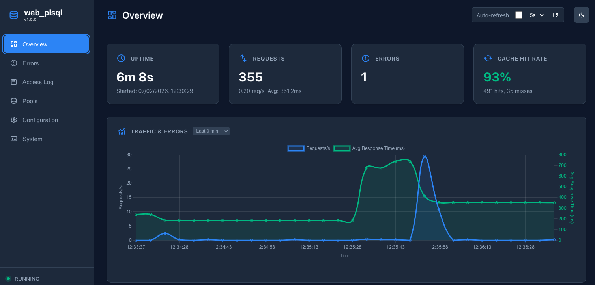

  [![NPM Version][npm-image]][npm-url]
  [![NPM Downloads][downloads-image]][downloads-url]
  [](https://github.com/doberkofler/web_plsql/actions/workflows/node.js.yml)
  [](https://coveralls.io/github/doberkofler/web_plsql?branch=master)

# Oracle PL/SQL Gateway Middleware for the Express web framework for Node.js
This Express Middleware is a bridge between a PL/SQL application running in an Oracle Database and an Express web server for Node.js.
It is an open-source alternative to the legacy **mod_plsql**, the Embedded PL/SQL Gateway, and the modern **Oracle REST Data Services (ORDS)** (specifically its PL/SQL Gateway mode).

It allows you to develop PL/SQL web applications using the PL/SQL Web Toolkit (OWA) and serve the content using the Express web framework for Node.js.

Please feel free to try and suggest any improvements. Your thoughts and ideas are most welcome.



# Release History
See the [changelog](https://github.com/doberkofler/web_plsql/blob/master/CHANGELOG.md).

# Prerequisites
The connection to the Oracle Database uses the node-oracledb Driver for Oracle Database. 
Please visit the [node-oracledb](https://node-oracledb.readthedocs.io/en/latest/index.html) documentation for more information.

# Installing
* Create and move to a new directory
* Create a new npm project (`npm i`)
* Install package (`npm i --omit=dev web_plsql`)

# Example

## Native
* Change to the `examples/sql` directory, start SQLPLus, connect to the database as SYS specifying the SYSDBA roleInstall and install the sample schema `@examples/sql/install.sql`.
* Start server using `node examples/config-native.js` after having set the WEB_PLSQL_ORACLE_SERVER environment variable to the database where you just installed the sample schema.
* Invoke a browser and open the page `http://localhost/sample`.

# Admin Console

`web_plsql` includes a built-in Admin Console for real-time monitoring and management of your gateway.

## Features
- **Dashboard**: Real-time charts showing requests per second and error rates.
- **Pool Monitoring**: Visual representation of database connection pool usage.
- **Cache Management**: View and manage the metadata cache.
- **Access & Error Logs**: Interactive viewers for the server logs.
- **System Info**: Overview of the server environment and configuration.

## Configuration
The admin console is enabled by default in the `startServer` API. You can configure it via the `admin` property in the main configuration object.

```typescript
/**
 * @typedef {object} configAdminType
 * @property {boolean} [enabled=true] - Whether the admin console is enabled.
 * @property {string} [route='/admin'] - The route path for the admin console.
 */
```

Access the console at `http://localhost:<port>/admin` (e.g., `http://localhost:8080/admin`).

# Configuration

There are 2 options on how to use the web_plsql express middleware:
- Use the predefined `startServer` api in `dist/backend/index.js` like in the `examples/config-native.js` example
- Hand craft a new Express server using the `handlerWebPlSql` middleware in `dist/backend/index.js`

## Use the predefined `startServer` function

The `startServer` API uses a `configType` configuration object. You can review the complete type definitions in the source code:
[src/backend/types.ts](https://github.com/doberkofler/web_plsql/blob/master/src/backend/types.ts)

## Hand Craft Express Server with Composable Middleware

The web_plsql API exports composable middleware components that can be integrated into any Express application.
Start by having a look at the build-in server code:
[src/backend/server/server.ts](https://github.com/doberkofler/web_plsql/blob/master/src/backend/server/server.ts)

### AdminContext Requirement

The admin console requires an `AdminContext` instance to be passed as the second argument to `handlerAdminConsole`.

**Using `startServer()` API:** `AdminContext` is managed automatically.

**Using custom Express app:** You must instantiate `AdminContext` and pass it to the handler.

```typescript
const adminContext = new AdminContext(config, pools, caches);
app.use('/admin', handlerAdminConsole(config, adminContext));
```

# Compare with Oracle REST Data Services (ORDS)

`web_plsql` is a specialized, lightweight alternative to ORDS for scenarios where only the **PL/SQL Gateway** functionality is required.

| Feature | web_plsql | Oracle REST Data Services (ORDS) |
| :--- | :--- | :--- |
| **Primary Goal** | Focused, high-performance PL/SQL Gateway | Full REST platform and PL/SQL Gateway |
| **Technology** | Node.js (V8 engine) | Java (JVM) |
| **Deployment** | Lightweight, Docker-native | Requires Jetty/Tomcat or WebLogic |
| **Configuration** | Modern JSON / Environment Variables | XML files and Database Metadata |
| **Monitoring** | Built-in real-time SPA Admin Console | SQL Developer or separate OCI monitoring |
| **Caching** | Efficient LFU (Least Frequently Used) memory cache | Java-based metadata and result caching |

The following ORDS configuration (typically found in `conf/ords/defaults.xml` or `settings.xml`) translates to the `web_plsql` configuration options as follows:

**ORDS**
```xml
<entry key="db.username">sample</entry>
<entry key="db.password">sample</entry>
<entry key="db.hostname">localhost</entry>
<entry key="db.port">1521</entry>
<entry key="db.servicename">ORCL</entry>
<entry key="misc.defaultPage">sample_pkg.page_index</entry>
<entry key="security.requestValidationFunction">sample_pkg.request_validation_function</entry>
<entry key="owa.docTable">LJP_Documents</entry>
```

**web_plsql**
```typescript
{
    routePlSql: [
        {
            user: 'sample', // db.username
            password: 'sample', // db.password
            connectString: 'localhost:1521/ORCL', // db.hostname, db.port, db.servicename
            defaultPage: 'sample_pkg.page_index', // misc.defaultPage
            requestValidationFunction: 'sample_pkg.request_validation_function', // security.requestValidationFunction
            documentTable: 'LJP_Documents', // owa.docTable
        }
    ]
}
```

# Compare with mod_plsql

The following mod_plsql DAD configuration translates to the configuration options as follows:

**DAD**
```
<Location /pls/sample>
  SetHandler                     pls_handler
  Order                          deny,allow
  Allow                          from all
  PlsqlDatabaseUsername          sample
  PlsqlDatabasePassword          sample
  PlsqlDatabaseConnectString     localhost:1521/ORCL
  PlsqlDefaultPage               sample_pkg.pageIndex
  PlsqlDocumentTablename         doctable
  PlsqlPathAlias                 myalias
  PlsqlPathAliasProcedure        sample_pkg.page_path_alias
  PlsqlExclusionList             sample_pkg.page_exclusion_list
  PlsqlRequestValidationFunction sample_pkg.request_validation_function
  PlsqlErrorStyle                DebugStyle
  PlsqlNlsLanguage               AMERICAN_AMERICA.UTF8
</Location>
```

**web_plsql**
```typescript
{
	port: 80,
	routeStatic: [
		{
			route: '/static',
			directoryPath: 'examples/static',
		},
	],
	routePlSql: [
		{
			route: '/sample',
			user: 'sample', // PlsqlDatabaseUserName
			password: 'sample', // PlsqlDatabasePassword
			connectString: 'localhost:1521/ORCL', // PlsqlDatabaseConnectString
			defaultPage: 'sample_pkg.page_index', // PlsqlDefaultPage
			documentTable: 'doctable', // PlsqlDocumentTablename
			exclusionList: ['sample_pkg.page_exclusion_list'], // PlsqlExclusionList
			requestValidationFunction: 'sample_pkg.request_validation_function', // PlsqlRequestValidationFunction
			pathAlias: 'myalias', // PlsqlPathAlias
			pathAliasProcedure: 'sample_pkg.page_path_alias', // PlsqlPathAliasProcedure
			transactionMode: 'commit',
			errorStyle: 'debug', // PlsqlErrorStyle
		},
	],
	uploadFileSizeLimit: 50 * 1024 * 1024, // 50MB
	loggerFilename: 'access.log', // PlsqlLogEnable and PlsqlLogDirectory
}
```

# Configuration options

## Supported ORDS configuration options
- db.username -> routePlSql[].user
- db.password -> routePlSql[].password
- db.hostname, db.port, db.servicename -> routePlSql[].connectString
- misc.defaultPage -> routePlSql[].defaultPage
- security.requestValidationFunction -> routePlSql[].requestValidationFunction
- owa.docTable -> routePlSql[].documentTable

## Supported mod_plsql configuration options
- PlsqlDatabaseConnectString -> routePlSql[].connectString
- PlsqlDatabaseUserName -> routePlSql[].user
- PlsqlDatabasePassword -> routePlSql[].password
- PlsqlDefaultPage -> routePlSql[].defaultPage
- PlsqlDocumentTablename -> routePlSql[].documentTable
- PlsqlErrorStyle -> routePlSql[].errorStyle
- PlsqlLogEnable -> loggerFilename
- PlsqlLogDirectory -> loggerFilename
- PlsqlPathAlias -> routePlSql[].pathAlias
- PlsqlPathAliasProcedure -> routePlSql[].pathAliasProcedure
- PlsqlRequestValidationFunction -> routePlSql[].requestValidationFunction
- PlsqlExclusionList -> routePlSql[].exclusionList
- Basic and custom authentication methods, based on the OWA_SEC package and custom packages.
- Caching of procedure metadata and validation results for high performance.
- Real-time monitoring and management via a built-in Admin Console.

## Options that are only available in web_plsql
- The option `transactionModeType` specifies an optional transaction mode.
  "commit" this automatically commits any open transaction after each request. This is the defaults because this is what mod_plsql and ohs are doing.
  "rollback" this automatically rolls back any open transaction after each request.
  "transactionCallbackType" this allows defining a custom handler as a JavaScript function.


# License

[MIT](LICENSE)


[npm-image]: https://img.shields.io/npm/v/web_plsql.svg
[npm-url]: https://npmjs.org/package/web_plsql

[downloads-image]: https://img.shields.io/npm/dm/web_plsql.svg
[downloads-url]: https://npmjs.org/package/web_plsql
